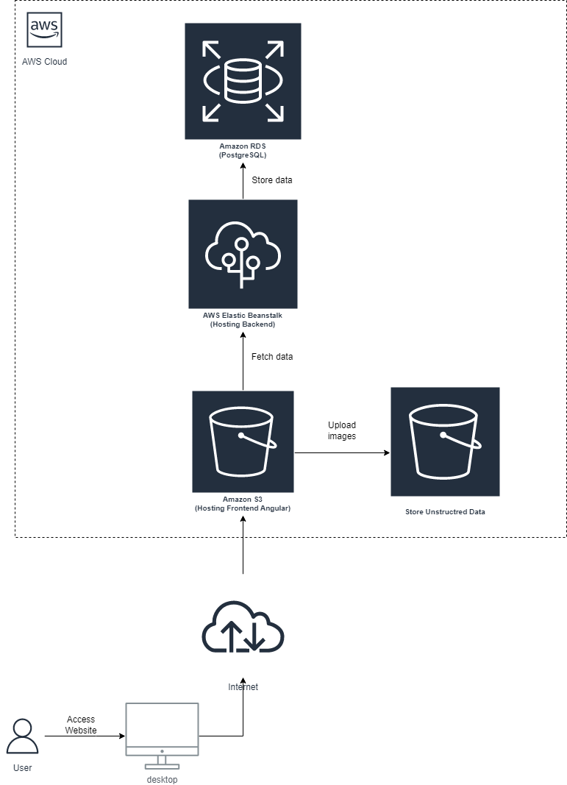

# Infrastructure

- The application uses `AWS services` as below to host website, store structured and unstructured data:

## 1. AWS Services:

- **AWS S3 bucket**: this service is used to host frontend website and upload image as well.
- **AWS RDS**: this service provides a lot of database to store data, but in this application, I use PostgresSQL 12 to store data.
- **AWS ElasticBeanstalk**: this service is used to host API of this application.
- **AWS EC2**: this service is used to run API application which is deployed by `ElasticBeanstalk` service.

## 2. Diagram:
 