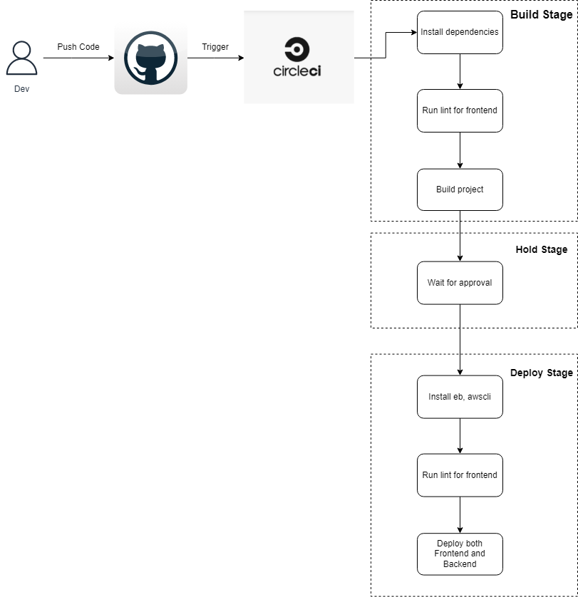

# Pipeline (CICD)

- The application uses `CircleCI` platform to help developer build, CI and CD.

## 1. Pipeline guide:

- **Build**: On this stage, the pipeline will run install both FE and BE, lint for FE, finally, it will build both FE and BE.
- **Hold**: On this stage, the pipeline will wait for approval (apply only for master branch).
- **Deploy**: On this stage, the pipeline will install node, eb, awscli, then, deploy both FE and BE (apply only for master branch).

## 2. Diagram:
